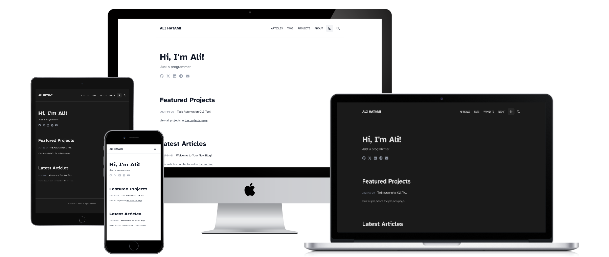

# 📝 Minimal Jekyll Blog

[](https://alihtt.github.io/al-minimal)

A modern, minimal personal blog built with Jekyll and Tailwind CSS. Perfect for developers who want a clean, professional blog on GitHub Pages.

[](https://jekyllrb.com/)
[](https://tailwindcss.com/)
[](https://www.docker.com/)
[](LICENSE)

## 🌟 Features

- **Responsive Design** - Beautiful dark theme, mobile-first approach
- **Blog Posts** - Markdown posts with pagination (10 per page)
- **Projects Portfolio** - Showcase your work
- **Tags System** - Organize posts by tags
- **Table of Contents** - Auto-generated TOC for long posts
- **Social Sharing** - Twitter, LinkedIn, Facebook, Reddit, Telegram
- **SEO Optimized** - Sitemap, meta tags, RSS feed
- **Clean URLs** - No `.html` extensions
- **GitHub Actions** - Automated deployment
- **Docker Support** - Run anywhere with zero setup
- **Fast & Lightweight** - Optimized performance

## 🚀 Getting Started

### Quick Start (No Installation Needed!)

The **fastest and easiest** way to get your blog live:

1. **Click "Use this template"** button at the top of this repository
2. **Create a new repository** from the template
   - Name it `yourusername.github.io` (replace with your GitHub username)
   - Choose **public**
   - Click "Create repository"
3. **Configure permissions**
   - Go to **Settings** → **Actions** → **General** → **Workflow permissions**
   - Select **Read and write permissions** and save
4. **Wait a few minutes** for GitHub Actions to build your site

**That's it! 🎉** Your blog is now live at `https://yourusername.github.io`

### Local Development with Docker (Recommended)

Want to customize locally? Use Docker for **zero dependency hassles**:

**Prerequisites:** Just install [Docker Desktop](https://docs.docker.com/get-docker/)

```bash
# Clone your repository
git clone https://github.com/yourusername/yourusername.github.io.git
cd yourusername.github.io

# Start with one command
make up

# Or using docker-compose
docker-compose up
```

Visit `http://localhost:4000` to see your blog! 🎉

Changes auto-reload with LiveReload!

**Available Commands:**
```bash
make help      # Show all commands
make up        # Start development server
make down      # Stop containers
make logs      # View logs
make shell     # Open shell in container
make dev       # Start with live CSS watching
make prod      # Build for production
make clean     # Clean up everything
```

**Why Docker?**
- ✅ No Ruby, Node.js, or gem installation needed
- ✅ Works identically on Windows, Mac, and Linux
- ✅ No dependency conflicts
- ✅ Clean system - everything in containers
- ✅ Easy updates - just rebuild

See [docs/INSTALL.md](docs/INSTALL.md#local-setup-using-docker-recommended) for detailed Docker instructions.

### Traditional Setup (Without Docker)

If you prefer installing dependencies locally:

**Prerequisites:**
- Ruby 3.0 or higher
- Node.js 18 or higher
- Bundler and npm

```bash
# Clone your repository
git clone https://github.com/yourusername/yourusername.github.io.git
cd yourusername.github.io

# Install dependencies
bundle install
npm install

# Build CSS
npm run build:css

# Run locally
bundle exec jekyll serve
```

Visit `http://localhost:4000` to preview! 🎉

**For detailed installation:** See [docs/INSTALL.md](docs/INSTALL.md)

## 📚 Documentation

Comprehensive guides to help you:

- **[Installation Guide](docs/INSTALL.md)** - Docker & traditional setup, troubleshooting
- **[Customization](docs/CUSTOMIZING.md)** - Make it yours
- **[Adding Content](docs/CONTENT.md)** - Write posts and projects
- **[Features Guide](docs/FEATURES.md)** - All features explained
- **[Deployment](docs/DEPLOYMENT.md)** - Deploy to GitHub Pages, Netlify, and more
- **[FAQ](docs/FAQ.md)** - Common questions answered

## ⚡ Quick Customization

Edit `_config.yml`:

```yaml
# -----------------------------------------------------------------------------
# Site settings
# -----------------------------------------------------------------------------

title: Your Name
first_name: Your
last_name: Name
greeting: "Hi, I'm Your Name!"
email: your-email@example.com
url: "https://yourusername.github.io"
icon: ⚛️  # emoji used as favicon

# Social Media
social:
  - icon: fa-brands fa-github
    link: https://github.com/yourusername
    name: GitHub
  - icon: fa-brands fa-x-twitter
    link: https://twitter.com/your_twitter
    name: Twitter / X
  # Add more...

# Navigation
navigation:
  - title: Articles
    url: /articles
  - title: Projects
    url: /projects
  - title: About
    url: /about
```

Configuration is organized into clear sections with comments.

**For more:** See [CUSTOMIZING.md](docs/CUSTOMIZING.md)

## 📝 Writing Your First Post

Create `_posts/2025-01-15-my-first-post.markdown`:

```yaml
---
layout: post
title: "My First Post"
date: 2025-01-15 10:00:00 +0000
tags: [tutorial, getting-started]
excerpt: "A brief description for SEO and previews"
---

## Welcome!

Your content here in **Markdown** format.

### Code Example

\`\`\`python
def hello():
    print("Hello, world!")
\`\`\`

### Images


**Easy!** 🎉
```

**For more details:** See [CONTENT.md](docs/CONTENT.md)

## 🐳 Docker Commands

Quick reference for Docker users:

| Command | Description |
|---------|-------------|
| `make up` | Start development server |
| `make down` | Stop all containers |
| `make restart` | Restart containers |
| `make logs` | Show container logs |
| `make shell` | Open bash in container |
| `make build` | Rebuild Docker image |
| `make clean` | Clean up everything |
| `make dev` | Start with live CSS watching |
| `make prod` | Build for production |
| `make install` | Install/update dependencies |

**Or use docker-compose directly:**
```bash
docker-compose up          # Start
docker-compose down        # Stop
docker-compose logs -f     # View logs
docker-compose build       # Rebuild
```

## 🚢 Deploy to GitHub Pages

1. **Push to GitHub**
   ```bash
   git add .
   git commit -m "Initial commit"
   git push origin main
   ```

2. **Enable GitHub Pages**
   - Go to **Settings** → **Pages**
   - Select **GitHub Actions** as source

3. **Configure Permissions**
   - Go to **Settings** → **Actions** → **General**
   - Select **Read and write permissions**

4. **Done!** Your site deploys automatically on every push! 🎉

   Visit: `https://yourusername.github.io`

**For detailed deployment:** See [DEPLOYMENT.md](docs/DEPLOYMENT.md)

## 📂 Project Structure

```
.
├── _includes/             # Reusable components
│   ├── header.html        # Site header
│   ├── share-buttons.html # Social sharing
│   └── social-icons.html  # Social media icons
├── _layouts/              # Page templates
│   ├── default.html       # Base layout
│   ├── page.html          # Static pages
│   ├── post.html          # Blog posts
│   └── project.html       # Project pages
├── _posts/                # Your blog posts (Markdown)
├── _projects/             # Your projects (Markdown)
├── assets/
│   ├── css/
│   │   ├── input.css      # Tailwind source (edit this)
│   │   └── main.css       # Compiled CSS (auto-generated)
│   └── images/            # Your images
├── docs/                  # Documentation
├── _config.yml            # Main configuration
├── Dockerfile             # Docker configuration
├── docker-compose.yml     # Docker Compose configuration
├── Makefile               # Convenient commands
├── Gemfile                # Ruby dependencies
├── package.json           # Node.js dependencies
└── README.md              # This file
```

## 🛠️ Development Workflow

### Using Docker

```bash
# Start development
make up

# Edit files in your favorite editor
# Changes auto-reload at http://localhost:4000

# For CSS changes with live rebuild
make dev

# Build for production
make prod
```

### Without Docker

**Terminal 1 - Jekyll Server:**
```bash
bundle exec jekyll serve --livereload
```

**Terminal 2 - CSS Watcher:**
```bash
npm run watch:css
```

Now edit files - both content and styles auto-reload!

## 🎨 Customization Examples

### Change Colors

Edit `assets/css/input.css`:

```css
:root {
  --color-primary: #3b82f6;  /* Your brand color */
  --color-bg: #0a0a0a;       /* Background */
  --color-text: #e0e0e0;     /* Text color */
}
```

Then rebuild: `npm run build:css`

### Add Google Analytics

Edit `_config.yml`:

```yaml
google_analytics: G-XXXXXXXXXX
```

### Use Custom Domain

1. Create `CNAME` file with your domain:
   ```
   yourdomain.com
   ```

2. Configure DNS at your registrar:
   ```
   A    @    185.199.108.153
   A    @    185.199.109.153
   A    @    185.199.110.153
   A    @    185.199.111.153
   ```

3. Update `_config.yml`:
   ```yaml
   url: "https://yourdomain.com"
   ```

4. Enable in GitHub: Settings → Pages → Custom domain

See [DEPLOYMENT.md](docs/DEPLOYMENT.md#custom-domain) for details.

## 🙏 Acknowledgments

Powered by these amazing tools:

- **[Jekyll](https://jekyllrb.com/)** - Static site generator
- **[Tailwind CSS](https://tailwindcss.com/)** - Utility-first CSS framework
- **[Font Awesome](https://fontawesome.com/)** - Icons
- **[jekyll-paginate](https://github.com/jekyll/jekyll-paginate)** - Pagination
- **[GitHub Pages](https://pages.github.com/)** - Free hosting
- **[Docker](https://www.docker.com/)** - Containerization platform

## 📖 Resources

### Jekyll
- [Official Documentation](https://jekyllrb.com/docs/)
- [Jekyll Talk Forum](https://talk.jekyllrb.com/)
- [Liquid Template Language](https://shopify.github.io/liquid/)

### Tailwind CSS
- [Official Documentation](https://tailwindcss.com/docs)
- [Tailwind UI](https://tailwindui.com/)
- [Tailwind Components](https://tailwindcomponents.com/)

### Markdown
- [Markdown Guide](https://www.markdownguide.org/)
- [GitHub Flavored Markdown](https://github.github.com/gfm/)
- [Markdown Cheatsheet](https://github.com/adam-p/markdown-here/wiki/Markdown-Cheatsheet)

## 🤝 Contributing

Contributions are welcome! See [CONTRIBUTING.md](CONTRIBUTING.md) for guidelines.

**Ways to contribute:**
- 🐛 Report bugs
- 💡 Suggest features
- 📝 Improve documentation
- 🔧 Submit pull requests
- ⭐ Share your blog (for inspiration)

## 📄 License

MIT License - See [LICENSE](LICENSE) for details.

Free to use for personal and commercial projects.

## 💬 Support

- 📖 Read the [comprehensive documentation](docs/)
- 🔍 Search [existing issues](../../issues)
- 💭 Ask questions in [GitHub Discussions](../../discussions)
- 🐛 Report bugs by [opening an issue](../../issues/new)

## 🌟 Show Your Support

If you find this template useful:

- ⭐ **Star this repository** to show your appreciation
- 🍴 **Fork it** to create your own blog
- 📢 **Share it** with others who might benefit
- 🤝 **Contribute** to make it even better

## 🎯 What's Next?

After setting up your blog:

1. ✅ **Customize** - Make it yours ([CUSTOMIZING.md](docs/CUSTOMIZING.md))
2. ✅ **Write** - Create your first post ([CONTENT.md](docs/CONTENT.md))
3. ✅ **Deploy** - Go live on GitHub Pages ([DEPLOYMENT.md](docs/DEPLOYMENT.md))
4. ✅ **Share** - Tell the world about your blog!
5. ✅ **Maintain** - Keep dependencies updated

## 🚀 Live Examples

Sites using this template:
- [My Blog](https://alihtt.github.io) - Submit yours!

**Using this template?** [Let us know](../../discussions) and we'll feature you here!

---

**Made with ❤️ for developers by developers**

⭐ Star this repo if you find it useful!

🍴 Fork it to create your own blog!

📢 Share it with others!

🐛 [Report issues](../../issues) or [contribute](CONTRIBUTING.md)!
